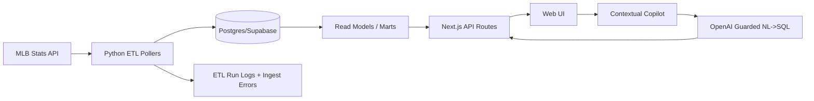

# Architecture Diagram (Mermaid)

## Notes
- V1 uses adaptive polling and idempotent writes.
- UI queries curated read models; no direct table exposure.
- Copilot is scoped by route context and SQL allowlist.

